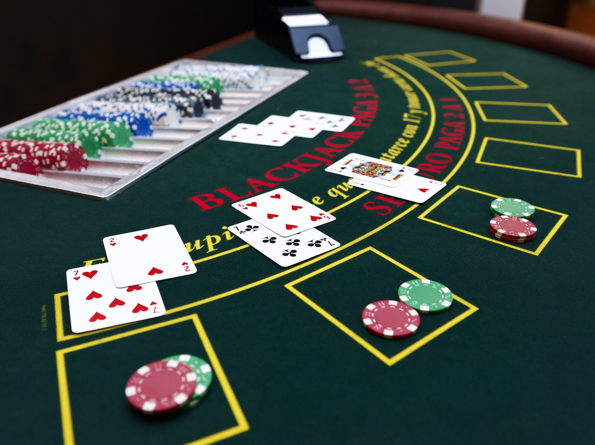

# Blackjack

  

## Note
Note: the code for this project is in the [Blackjack repository](https://github.com/z1chh/Blackjack).

## Card values
1. Numbered cards are counted at their face value (two counts as 2 points, three, 3 points, and so on)
2. An Ace count as either 1 point or 11 points (whichever suits the player best)
3. Jack, queen and king count 10 points each

## Game Rules
* The user will compete against the computer which represents the casino.
* The goal of the user is to try to reach a total point sum of 21 without exceeding it. Whoever exceeds 21 first loses (technically known as busting).
* At the beginning of each round, the user is dealt two open cards and the computer is dealt one open card. The cards are open, meaning that the values are known for both, the user and the computer (no hidden cards).
* The user will see the sum of the points from his 2 open cards and decides whether or not to draw an additional card.
* The user may draw one additional card at a time for as long as they like or until they bust (sum of drawn cards exceeds 21). If they bust, they lose the round.
* When the user decides that they won’t draw anymore and they are happy with whatever total amount they got, the computer will draw and open an additional card.
* The computer will keep on drawing additional cards, one at a time as long as the sum of its cards is less than the user's cards.
* If the computer busts, the user wins.
* If the computer doesn’t bust (total sum is less or equal 21), then the total values are compared between the computer and the user. Whomever has a higher value wins the round.
* If the two totals are the same, no one wins the round (technically called a push).

## Classes
### Card
Represents a card, with a rank and suit enums

Methods:
* getValue: returns the numerical value of the card
* displayCard: outputs to the screen the card information

### Hand
Represents the set of cards that a player holds (up to 12 cards)

Methods:
* add: adds a card to the hand
* clear: clears all cards in the hand
* getTotal: returns the sum of the cards' numerical values

### Deck
Represents a standard deck of 52 cards

Methods:
* populate: creates a standard deck of 52 cards
* shuffle: shuffles the cards in the deck
* deal: deals a card to one hand

### AbstractPlayer
Represents a generic abstract player (human or computer)

Methods:
* isDrawing: returns whether the player wants to draw a card or not
* isBusted: returns whether the player busted or not (exceeded 21)
* 
### HumanPlayer
Represents a human player (concrete implementation of AbstractPlayer)

Methods:
* isDrawing: returns whether the player wants to draw a card or not
* announce: prints information about whether the player won, lost, or had a push situation
* 
### ComputerPlayer
Represents a computer player (concrete implementation of AbstractPlayer)

Method:
* isDrawing: returns whether the player wants to draw a card or not

### BlackJackGame
Represents the overall game of Blackjack

Fields:
* m_deck: the deck that is used to play an instance of the game
* m_casino: the ComputerPlayer that represents the casino

Method:
* play: plays an instance of the game of Blackjack (including deck initialization, etc)

