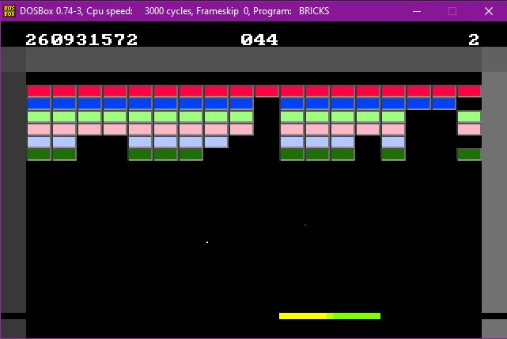

# Brick-Breaker-Game

  

## Note
Note: the code for this project is in the [Brick Breaker Game repository](https://github.com/z1chh/Brick-Breaker-Game).

## Setup
I used DOSBox 0.74-3 to run my game.
From within DOSBox, I first mounted my drive such that I'm in the same directory as the [bricks.asm file](https://github.com/z1chh/Brick-Breaker-Game/blob/main/bricks.asm) and the [UTIL_BR.OBJ file](https://github.com/z1chh/Brick-Breaker-Game/blob/main/UTIL_BR.OBJ).
Then, I compiled the code as follows:
* `tasm bricks`
* `tlink bricks util_br`

Finally, simply write `bricks` to run the application and play the game.

## Game Rules
* Break all the bricks before you lose all your balls to win the game
* Use the paddle to prevent the ball from falling, which costs a life
* Press 'a' or 'A' to move the paddle to the left
* Press 'd' or 'D' to move the paddle to the right
* Use 50 points to activate a power-up

## Power-Ups
Each brick that is broken awards points, and 50 points can be used to activate a power-up.

Point Distribution:
* Bricks in the bottom two rows: 2 points
* Bricks in the middle two rows: 3 points
* Bricks in the top two rows: 5 points

Power-Ups:
* Long Paddle (Press 1): doubles the size of your paddle (500 iterations of the main loop)
* Laser (Press 2): shoots out a pixel-sized red laser out of the middle of the paddle, towards the top of the screen (destroys at most one brick)

  

## OpenGL and GLSL Cover Art
The [coverart.c file](https://github.com/z1chh/Brick-Breaker-Game/blob/main/coverart.c) draws a scene that looks like my brick breaker game.

### Covert Art Runtime Environment
I used PuTTY on my Windows PC to connect to open-gpus.cs.mcgill.ca on port 22 (SSH with enabled X11 forwarding).

I then used the following command to get the right mesa GL version: `export MESA_GL_VERSION_OVERRIDE=3.3`.

Then, to gcc the [coverart.c file](https://github.com/z1chh/Brick-Breaker-Game/blob/main/coverart.c), I used the -lglut and -lGL options (with -o coverart).

## Game Implementation
The [bricks.asm program](https://github.com/z1chh/Brick-Breaker-Game/blob/main/bricks.asm) interacts with the GPU to display the game, but also to interact (a ball collision is determined when it hits a non-black pixel - bricks are coloured and walls have fixed x- and y- coordinates on the screen).

### Main Loop
The [main](https://github.com/z1chh/Brick-Breaker-Game/blob/main/bricks.asm#L1081) contains an infinite loop that stops whenever the user wins or loses the game. It takes care of calling every method and checking for user input:
* Moving the ball
* Checking for user input (move the paddle or activate a power-up)
* Checking for collisions (and act accordingly)
* Reset a power-up if it is done (laser hits something or long paddle duration reached)

### Ball
[Global variables](https://github.com/z1chh/Brick-Breaker-Game/blob/main/bricks.asm#L20) are used to keep track of the ball's x- and y-coordinates, as well as the x- and y-velocity.

The ball is represented by drawing a pixel at its current location. Its movement is represented by setting the pixel at its current location back to black (background color), and drawing the white pixel at a new location, according to its x- and y-velocities.

A collision with the wall is determined when the ball reaches a corner (since the video mode is set to 13h, the x- and y-coordinates can easily be computed). Depending on the wall that the ball hit, the x- and/or y-velocities will be inverted.

A collision with the paddle changes the direction depending on which section of the paddle the ball hit (see the [Paddle section down below](https://github.com/z1chh/Brick-Breaker-Game#paddle)).

Losing the ball resets the ball at the initial position (as well as the paddle), and the program waits for user input before continuing the game. A life will be decreased as well. A ball is lost if its y-coordinate is greater than 199 (bottom of the screen = higher y-coordinate).

### Paddle
[Global variables](https://github.com/z1chh/Brick-Breaker-Game/blob/main/bricks.asm#L26) are used to keep track of the paddle's x-coordinate (left-end of the paddle) (the y-coordinate does not change - hardcoded) and its length (default is 32, power-up 1 changes it temporarily to 64).

The drawPaddle method takes as input the x-coordinate of the paddle and its length. It then draws 3 rectangles and fills them with their own color.

Moving the paddle changes its x-coordinate by 8 pixels, while making sure that it doesn't get out of the screen (which technically means that the paddle would appear higher or lower in the screen, depending of if you moved too far to the left or right).

### Bricks
Whenever the ball collides with a brick, the direction in which it returns depends on whether the ball hit the brick on the left/right side, top/bottom, or in a corner.

When a brick is hit, it disappears, and points are awarded.

### Power-Ups
The [Long Paddle](https://github.com/z1chh/Brick-Breaker-Game/blob/main/bricks.asm#L31) power-up has a global counter that keeps track of how long it has been active for.

The Laser power-up has [global variables](https://github.com/z1chh/Brick-Breaker-Game/blob/main/bricks.asm#L33) to keep track of its x- and y-coordinates (velocity always goes up by 1 - 0 horizontally, so these values are hardcoded), and a counter that keeps track of whether it is active or not.

If the Laser is active, the [drawPixel](https://github.com/z1chh/Brick-Breaker-Game/blob/main/bricks.asm#L44) method is used (same as the one that draws the ball), but with a red pixel, until it hits the ceiling or a brick.

