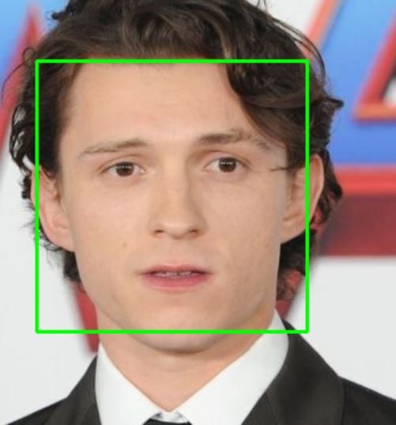

# Face-Detection-App

## Note
Note: the code for this project is in the [Face-Detection-App
](https://github.com/z1chh/Face-Detection-App).

  

The [face_finder.py](https://github.com/z1chh/Face-Detection-App/blob/master/face_finder.py) and [face_detector.py](https://github.com/z1chh/Face-Detection-App/blob/master/face_detector.py) use OpenCV's Haar Cascade algorithm (pretty rudimentory face detection algorithm), which uses Haar features (chained) that match a frontal face.

The image goes through the classifier and a face is detected if it passes through all of the Haar cascades. This is done for every type, size and location in the image (to detect the faces). Whenever multiple squares are close together, they are grouped into a single face. This algorithm is pre-trained by OpenCV, [here](https://youtube.com/watch?v=hPCTwxF0qf4) is a visualization of the Haar cascade.

## Face Finder

[face_finder.py](https://github.com/z1chh/Face-Detection-App/blob/master/face_finder.py) takes an image as input, and detects frontal faces in that image.
Detected faces have a green rectangle around them.

### Setup

To change the image used for the face detection algorithm, modify the source image (path) at line 7.

To change the classifier sensitivity:

- Set the min_neighbors to a lower value to lower the sensitivity (line 8)
- Set the min_neighbors to a higher value to increase the sensitivity (line 8)

## Face Detector

[face_detector.py](https://github.com/z1chh/Face-Detection-App/blob/master/face_detector.py) detects frontal faces in videos.
Program that detects faces in real-time, for example with a live video.
Detected faces have a green rectangle around them.

### Setup

To change the video source:

- Set the use_camera boolean to True if using a camera (line 11)
- Set the use_camera boolean to False if using a video file (line 11)
- Set the webcam to use (default camera corresponds to 0) (line 12)
- Set the video_to_use variable (update path) (line 13)

To change the classifier sensitivity:

- Set the min_neighbors to a lower value to lower the sensitivity (line 14)
- Set the min_neighbors to a higher value to increase the sensitivity (line 14)
