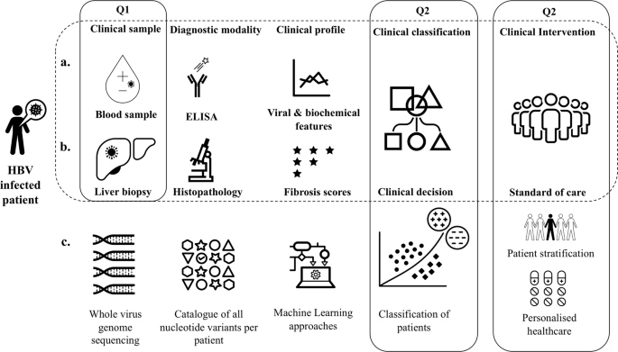
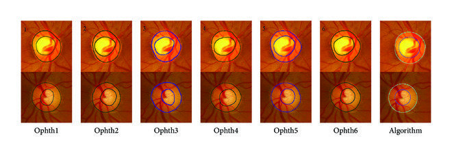

# Hepatitis and Messidor (Machine Learning)

  
  

## Note
Note: the code for this project is in the [Hepatitis-and-Messidor-Machine-Learning repository](https://github.com/z1chh/Hepatitis-and-Messidor-Machine-Learning).

## Setup
Note that I used PyDrive to access the datasets. The hepatitis dataset is contained within a .csv file, and the messidor dataset is contained within an .arff file.

## Data Cleaning
I first cleaned the data from both datasets and removed invalid values (such as rows with a '?' instead of an actual value).

## Stats
I then presented some basic statistics on each set (min and max values, mean, standard deviation, and correlation).

## K-Nearest Neighbours Classifier
I defined methods to train and predict to implement the models from scratch, without using any librairies (such as SciKit).

Methods:
* fit: simply store the data (lazy learner)
* predict: make a prediction using the stored training data and the test data given as argument

## Decision Tree
I defined methods to train and predict to implement the models from scratch, without using any librairies (such as SciKit). To do so, I first defined a node class, and used a greedy splitting of a node. I also implemented cost functions (such as gini index).

## Experiments
I ran the different models and compared the accuracy on the two datasets by modifying the following parameters/elements:
* KNN and decision tree algorithms
* different K values
* maximum tree depth
* distance/cost functions
I then presented plots for these experiment, as well as a plot of the decision boudary for each of the models (see the [Hepatitis and Messidor Analysis file](https://github.com/z1chh/Hepatitis-and-Messidor-Machine-Learning/blob/main/Hepatitis%20and%20Messidor%20Analysis.ipynb).
